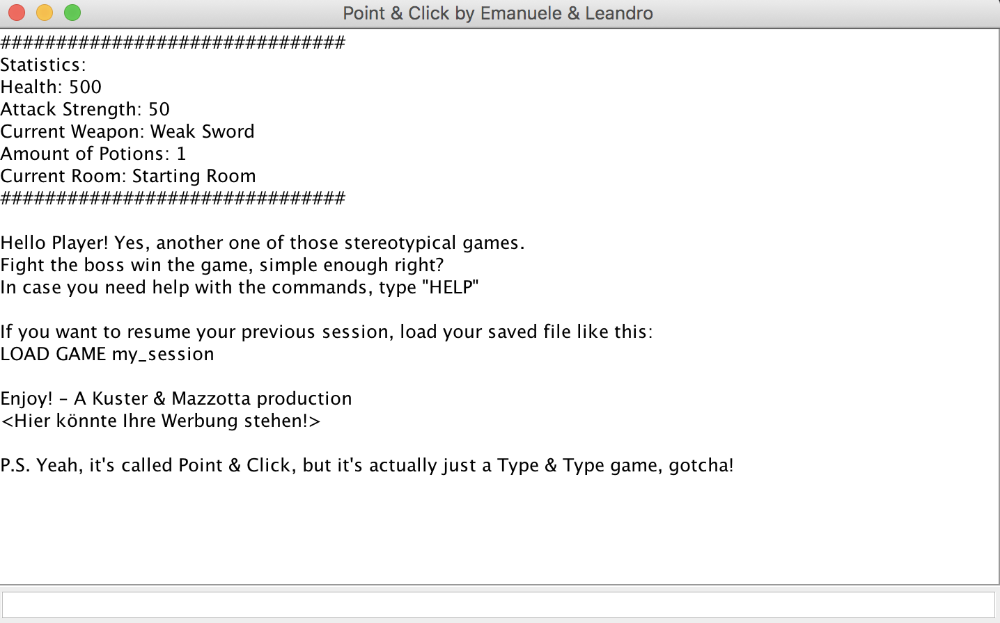

[](https://github.com/emazzotta/cli-adventure-game/actions)
[](https://github.com/emazzotta/cli-adventure-game/actions)
[](LICENSE.md)

# Point & Click Adventure 

A click and point (more a type and type) adventure for university.

## Screenshot

[](https://github.com/emazzotta/cli-adventure-game)

## Prerequisites

* JDK 1.8 or later
* Maven 3 or later

## Run

```bash
git clone git@github.com:emazzotta/cli-adventure-game.git && \
    cd cli-adventure-game && \
    make
```

## Contribution Guidelines 

* Red (write a failing test)
* Green (make the test pass)
* Refactor (make the code sexy)

## Authors 

[Emanuele Mazzotta](mailto:hello@mazzotta.me)  
Leandro Kuster
